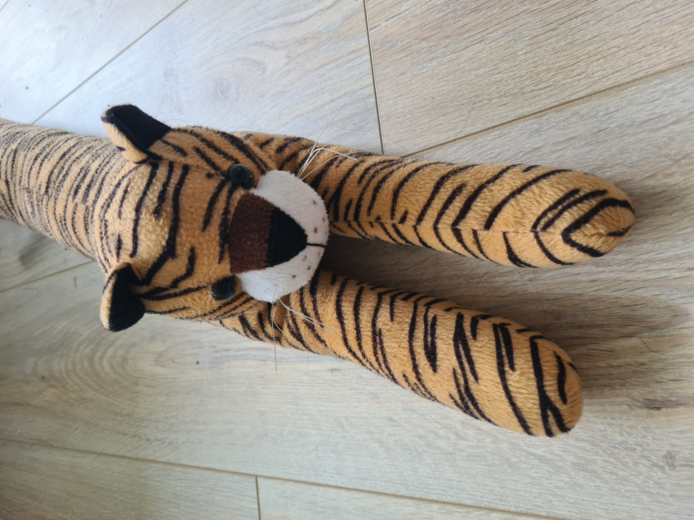
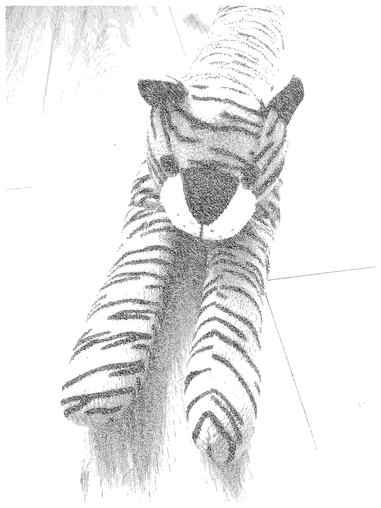
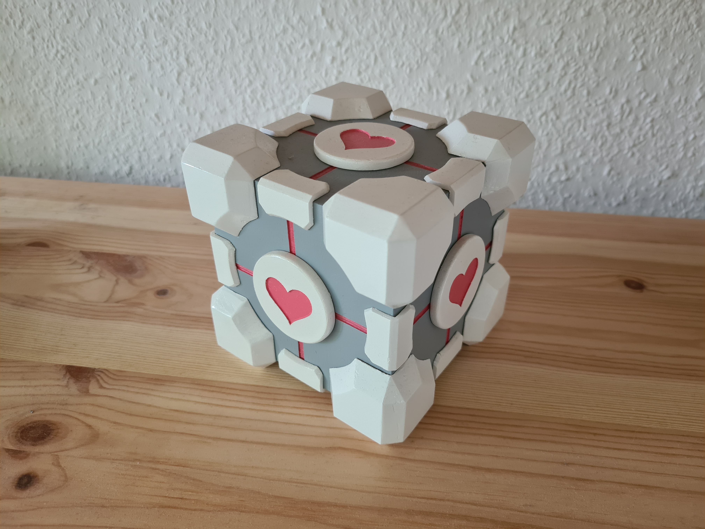
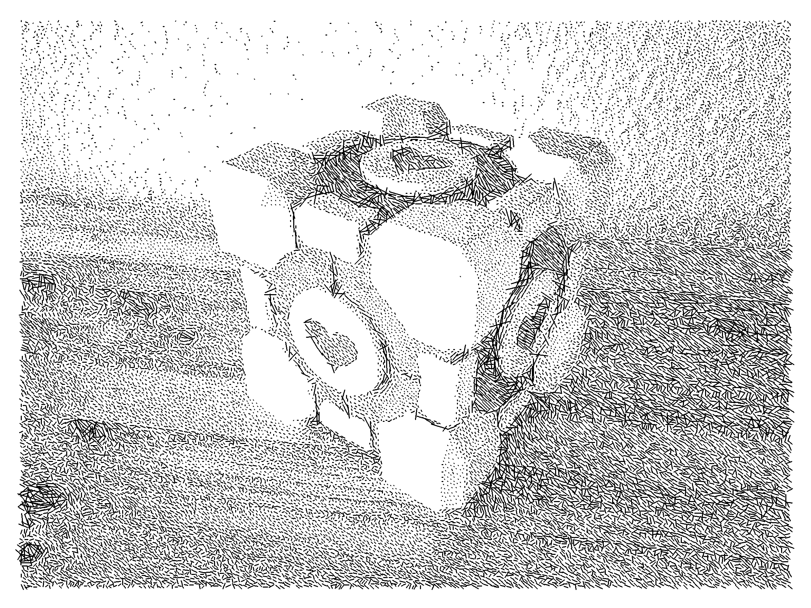

# doodle_me

Sketch-like image stylization using webassembly.

**Live Demo:** https://matthias95.github.io/doodle_me/ 

# Usage
The repo contains a `Dockerfile` with all dependencies required to compile webassembly. `./dockerenv.sh` build the docker image and executes all supplied commands within in. 
### Run demo in local webserver
`./dockerenv.sh make serve`

### Build
`./dockerenv.sh make c_functions.js`

# Samples

  
  

  
  

